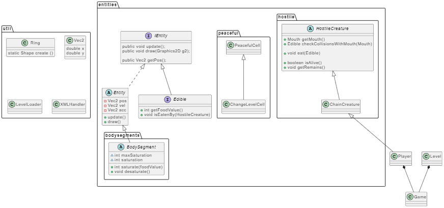
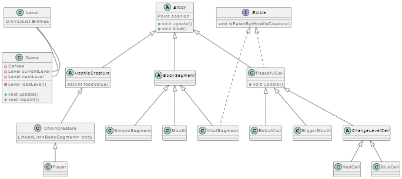

<h1 style = "text-align:center">flOw - Dokumentáció</h1>

## Házi feladat - Pallos Gábor György QN1SXN

# A program struktúrája
A programot az alábbi packagekbe szerveztem.

## A packagek leírása

## flow
Ez a package tartalmazza a játék elemeit. 
Az alábbi classokat tartalmazza:
- Game: Ez az osztály felelős a játék indításáért és futtatásáért, valamint a szintek betöltésért.
- Level: Ez az osztály egy adott szinten belül történő eseményekről gondoskodik, kezeli a lények interakcióit. 
- GameCanvas: A játék kirajzolása ezen az osztályon történik.
- Player: Ez az osztály egy MouseListener segítségével irányítja a játékos lényének mozgását.

## entities
Ez a package tartalmazza a játék lényeit. És a viselkedésükhöz szükséges elemeket
- Itt találhazó az Entity interface, amit minden játékbeli lénynek implementálni kell. az update() metódusokban kell megvalósítani a lények logikáját, a draw() metódussal rajzolhatók ki a lények.
- Az Edible interfacet implementáló lények ehetőek.
- A BodySegments package elemeket tartalmaz, amikből egy lényt fel lehet építeni.
- A hostile package-ben az ellenséges lények implementációja található
- A peaceful package-ben a békés sejtek implementációja van.
  
A lények leszármazási viszonyai jobban láthatók az alábbi diagrammon.

## util
Ez a package tartalmazza a játékhoz tartozó segédclassokat. 
- LevelLoader: Egy pálya létrehozásáért felelős osztály, loadLevel metódusával akárhányszor létre lehet hozni a bele töltött szintet.
- XMLHandler: Egy XML fileból létrehoz egy játékot és feltölti a file-ban talált szinteket létrehozó LevelLoader osztályokkal.
- Vec2: Egy 2 dimenziós vektor, a játék grafikájához mindenütt szükség volt erre. 
- Ring: A create metódusával létrehozható egy gyűrű alakzat, a játék grafikájához többször szükség volt rá.

