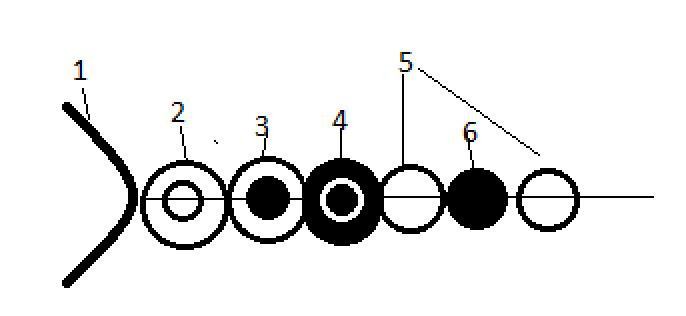

<h1 style = "text-align:center">flOw - Specifikáció</h1>

## Házi feladat - Pallos Gábor György QN1SXN 


# A játék
A játék szintekből áll, mindegyik egy különböző síkon zajlik. Egy adott síkról halványan láthatók az alatta lévő szint elemei.
A szintek között szabadon járhat át a játékos, mélyebbre mehet a piros sejt megevése által és magasabb szintre térhet vissza a kék sejt megevésével. Minden szinten megtalálható a kék és piros sejt, kivéve az első és utolsó szinten. Időnként a képernyőn megjelnik az irányukban egy kék és egy piros buborék, hogy könnyebben megtalálhatóak legyenek. A játékos által irányított lény az egeret követi, ha a szája ehető dologgal ütközik, azt elfogyasztja. Az egér lenyomására gyorsabban úszik a játékos.
A szintek véges nagyságúak, a szélüknél nem lehet tovább úszni. 

## A táplálkozás
A játékos több részből áll. Van egy szája és ehhez kapcsolódnak a további részei. A játékos megeheti a békésen lebegő sejteket, valamint más lények *szerves részeit*. 

## Az emésztés folyamata
A játékos részei lehetnek üresek, telítettek, vagy *szerves résszé* válhatnak.
Amikor egy játékos elfogyaszt egy egységnyi táplálékot, az végig kell, hogy haladjon a részeinek láncolatán. A táplálék feltölti a szájhoz legközelebb eső első üres helyet az organizmusban. Ha a teljes lény telítetté válik, a végére növeszt egy új üres sejtet, az egyszerű sejtjeinek telítettségét felhasználva. Ha többet eszik, mint amit be tud építeni, a táplálékot kiüríti egy sejt formájában.  


## A lények felépítése
Egy lény a következő részekből épülhet fel:
- **Száj**:
- **Szerves részek**: 2 egységnyi táplálékra van szükség a telítéshez, amikor telítve van életerőként szolgál.
- **Egyszerű sejtek**: 1 egységnyi tápláléktól telítődnek, telítettségük felhasználásával növeszthet újabb egyszerű sejteket a lény


### A játék elemei
- Játékos: 
   A játékos egy száj, szerves részek és egyszerű sejtek láncolatából áll.  
  
    1. Száj
    2. Telítetlen szerves rész   
    3. 1-szeresen telített szerves rész   
    4. 2-szeresen telített szerves rész   
    5. Üres sejt   
    6. Telített sejt   
- Békés sejtek:
    - A békés sejteknek különböző tápértékei lehetnek, nincs szájuk.
    - Adhatnak bónuszokat, mint nagyobb száj, vagy +1 szerves rész. 
    - Egy helyben lebegnek

- Kék/Piros sejtek:
    A kék és piros sejtek speciális békés sejtek, amik a szintek közötti navigációt irányítják
- Ellenségek: Ugyanúgy épülnek fel, mint a játékos, a békés sejteket meg tudják enni, de a piros/kék sejteket nem. Ha elpusztulnak (Összes szerves részüket megette a játékos) békés sejteket hagyhatnak maguk után. 
- 
### Az ellenségek mozgása
Az ellenségek mozgása a gép által irányított véletlenzerű úszkálásból áll. Ha az XML file-ban be van állítva az `agressive = "true"` jelző, akkor, ha a játékos látótávolságon belül van, elkezdik követni annak valamelyik ehető részét. Ha a kiszemelt ehető rész `attack-distancen` belül kerül, akkor `speed` sebességénél gyorsabban megindul felé a lény, vagy sikerül megennie, vagy nem. Ezután `rest-time` ideig nem támad.
Ha bármilyen békés lény kerül az ellenséges lény `attack-distance`-en belüli körzetébe, akkor azt a fentebb leírt módon megtámadja. 
Az `agressive`, `attack-distance`, `speed`, `rest-time` jelzők opcionálisak az XML file-ban. Mindegyiknek lesz egy értelmes default értéke. 

## A játékos pusztulása
Ha a játékos minden szerves részét megeszik, egy síkkal magasabbra kerül, ott folytathatja a játékot. Egy szerves részt visszakap. Minden sejtje telítetlenné válik, a hosszát megtartja.


# Megvalósítás terve
## A szintek 
Minden szinten egy XML fájl szerint jönnek létre az ott található lények és békés sejtek. A formátum:
```
<Game>
    <Level color = ""> 
        <SpawnPeacefulCells count = ""/> 
        <SpawnHostileCreature type = "" length = "" vitalSegments = "" speed = "" />
    </Level>
    <Level color = "">  
        <SpawnPeacefulCells count = "" foodValue = ""/> 
        <SpawnHostileCreature type = "HostileCreature" speed = "" agressive = "true" view-distance = "" attack-distance = "" rest-time = "">
    </Level>
    ...
</Game>
```
A `<SpawnPeacefulCells>` taggel lehet count számú egyszerű sejtet létrehozni. A `foodValue` segítségével lehet a tápértéküket beállítani.
A `<SpawnHostileCreature>` tag segítségével lehet ellenséges lényeket lehet létrehozni. A következő opcionális paraméterekkel rendelkezik a lény:
- `length`: Szegmensek száma
- `vitalSegments`: Hány szerves része legyen a lénynek (ezek mind telítetten jönnek létre)
- `speed`: A lény alapértelmezett sebessége
- `agressive`: A lény agresszív-e
- `view-distance`: Ha a lény agresszív, milyen távolságból kezdi el követni a játékost
- `attack-distance`: Milyen távolságból támadja meg a közelébe eső dolgokat
- `rest-time`: Támadás után mennyi ideig nem támad újra a lény.


#### Az eredeti játék 
Az eredeti játék Jenova Chen szakdolgozatának része. Kifejezetten érdekesek a koncepciók, amik sikeressé tették ezt a játékot. A szakdolgozat a következó linken található: https://web.archive.org/web/20191220043027/http://jenovachen.com/flowingames/introduction.htm
