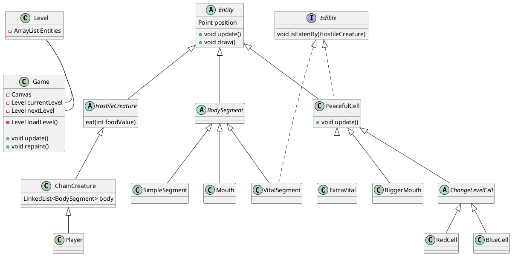

# A játék struktúrája
A játék a megjelenítéshez egy Canvas objektumot használok. Egy végtelen ciklus folyamatosan frissíti a játék állapotát, valamint újrarajzolja a Canvas-t.

A játék osztálydiagramja

